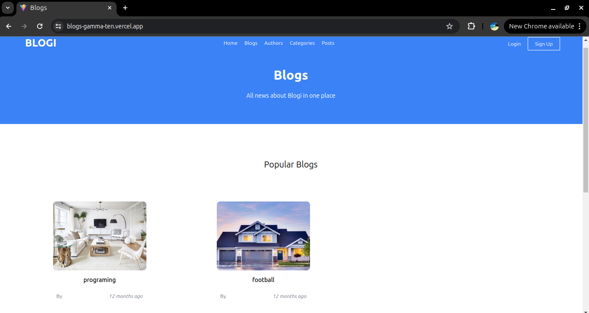
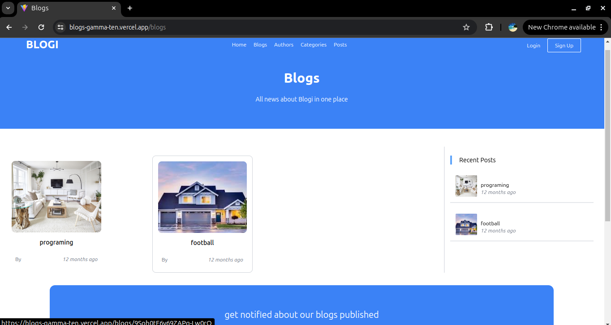
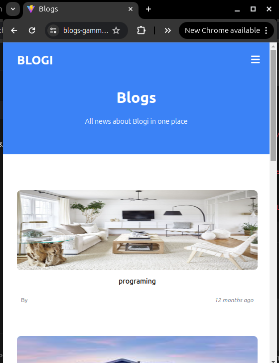

# 📝 Blogs –A Minimal Blog Interface

A simple and clean blog interface built with React, Vite, and TailwindCSS, perfect for showcasing blog posts in a responsive and modern UI.

## Features

- 📃 Clean and minimal blog layout  
- 🧩 Component-based architecture with reusable UI elements  
- 🎨 Styled with TailwindCSS for fast and responsive design  
- ⚡ Fast development with Vite and hot module replacement  
- 💻 Responsive design for desktop and mobile devices  
- ✍️ Create, edit, and delete blog posts  
- 🗂️ Manage categories: add, edit, and delete  
- 👤 Manage authors: add, edit, and delete author profiles  
- 🚀 Deployed on Vercel for easy hosting  


## 🚀 Live Demo

🔗 [View Live](https://blogs-gamma-ten.vercel.app)

## 🖼️ Screenshots

### Homepage


### Blog List


### Mobile Responsive View



## 📁 Project Structure

src/
├── components/        # Reusable UI components

├── pages/             # Main pages (e.g., blog listing)

├── assets/            # Static assets like images

├── App.jsx            # Root component

└── main.jsx           # Entry point

## Future Enhancements

- 🔐 User authentication: Login and Signup pages  
- 🛠️ Admin Panel for managing authors, posts, and categories  
- 📄 Support for Markdown content in blog posts  
- 🔔 Notifications and user roles/permissions  


## Installation and Setup

```bash
git clone https://github.com/melikaeslahi/blogs.git
cd blogs
npm install
npm run dev

```

## License

This project is licensed under the MIT License – see the [LICENSE](./LICENSE) file for details.